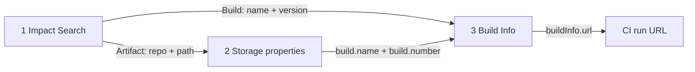

# Platform analyst API chain: flagged dependency → CI run

Recommended **happy-path** REST flow for a Security Analyst who has the smallest platform grants that complete every hop in the lab ([case F in RESULTS.md](../RESULTS.md)):

| Grant | Needed for |
|-------|------------|
| **Manage Reports** (`reports_manager` on the user) | Impact Search |
| **Build Read** on `artifactory-build-info` (pattern covering build names, e.g. `isplt-lab-*/**`) | Build Info and the CI run URL |
| **Repo Read** on repos that hold flagged **artifacts** | Artifact route only (Docker image manifest in this lab) |

If Impact Search returns only **Build** hits (typical for npm/Maven when builds are Xray-indexed), **Manage Reports + Build Read** is enough. Add **Repo Read** when the analyst follows an **Artifact** hit.

Set these for every call:

- Base URL: `https://<your-jpd>` (example: `https://tomjpd2.jfrog.io`)
- Header: `Authorization: Bearer <access_token>`

Maven Impact Search uses **`groupId:artifactId`** as `name` (e.g. `org.apache.commons:commons-lang3`), not the artifactId alone.

## Flow



Deduplicate by CI run URL when the same build appears as both a Build hit and via an artifact.

---

## 1. Impact Search

**Permission:** Manage Reports

**Request:**

```http
GET /xray/api/v2/search/impactedResources?limit=100&name=<name>&type=<type>&version=<version>
```

**Example (npm):**

```bash
curl -sS -H "Authorization: Bearer ${JF_ACCESS_TOKEN}" \
  "https://tomjpd2.jfrog.io/xray/api/v2/search/impactedResources?limit=100&name=semver&type=npm&version=7.6.3"
```

**Example (Maven — URL-encode `name`):**

```bash
curl -sS -H "Authorization: Bearer ${JF_ACCESS_TOKEN}" \
  "https://tomjpd2.jfrog.io/xray/api/v2/search/impactedResources?limit=100&name=org.apache.commons%3Acommons-lang3&type=maven&version=3.14.0"
```

**Fields used from the response:**

| Field | When |
|-------|------|
| `result[].type` | `"Build"` or `"Artifact"` — picks the route |
| `result[].name` | Build: build **name**. Artifact: file name or full path (Docker manifests often start with `/`) |
| `result[].version` | Build: build **number** |
| `result[].repo` | Artifact: repository key |
| `result[].path` | Artifact: directory prefix (may be `/`) |

**Build hit (example shape):**

```json
{
  "type": "Build",
  "repo": "builds",
  "name": "isplt-lab-npm-flagged",
  "version": "5"
}
```

**Artifact hit (Docker manifest example):**

```json
{
  "type": "Artifact",
  "repo": "isplt-docker-local",
  "path": "/isplt-docker-flagged/3/",
  "name": "manifest.json"
}
```

Skip artifact rows you do not intend to follow (e.g. `npm-remote-cache` tarballs with no lab build link). The script skips hits with no readable `build.name` after step 2.

---

## 2. Build reference (artifact route only)

**Permission:** Repo Read on the artifact’s repository

**Request:**

```http
GET /artifactory/api/storage/<repo><relative-path>?properties=build.name,build.number
```

Build the relative path like the lab harness:

- If `name` starts with `/`, use `name` as the path (e.g. `/isplt-docker-flagged/3/manifest.json`).
- Otherwise use `path` + `name` (normalize doubled slashes).

**Example:**

```bash
curl -sS -H "Authorization: Bearer ${JF_ACCESS_TOKEN}" \
  "https://tomjpd2.jfrog.io/artifactory/api/storage/isplt-docker-local/isplt-docker-flagged/3/manifest.json?properties=build.name,build.number"
```

**Fields used:**

| Field | Meaning |
|-------|---------|
| `properties["build.name"][0]` | Build name for step 3 |
| `properties["build.number"][0]` | Build number for step 3 |

**Build route:** skip this step. Use `name` and `version` from the Build hit directly.

---

## 3. Build Info → CI run URL

**Permission:** Build Read on `artifactory-build-info` for that build name pattern

**Request:**

```http
GET /artifactory/api/build/<build.name>/<build.number>
```

URL-encode the build name and number if they contain special characters.

**Example:**

```bash
curl -sS -H "Authorization: Bearer ${JF_ACCESS_TOKEN}" \
  "https://tomjpd2.jfrog.io/artifactory/api/build/isplt-lab-docker-flagged/5"
```

**Field used:**

| Field | Meaning |
|-------|---------|
| `buildInfo.url` | CI run URL (GitHub Actions in this lab) |

If `buildInfo.url` is empty, some pipelines still store the run in `buildInfo.properties` (e.g. `buildInfo.env.GITHUB_RUN_ID`). This lab’s workflow always sets `buildInfo.url`.

---

## Runnable helper

[scripts/find_ci_runs.py](../scripts/find_ci_runs.py) runs the chain for one package query. It uses only the Python standard library.

```bash
export JF_URL=https://tomjpd2.jfrog.io
export JF_ACCESS_TOKEN="$(cat lab/tokens/lab-plt-f.token)"   # case F persona

python3 scripts/find_ci_runs.py --name semver --type npm --version 7.6.3
python3 scripts/find_ci_runs.py --name 'org.apache.commons:commons-lang3' --type maven --version 3.14.0
```

Output is one line per unique CI run URL:

```text
<hit kind>  <hit label>  <build name>/<number>  <CI run URL>
```

---

## When permissions are missing (not handled by the script)

For troubleshooting, see [RESULTS.md](../RESULTS.md):

- No **Manage Reports** → Impact Search **403** (empty body).
- No **Build Read** → Build Info **403** with *Read permission is needed* (customer case D).
- No **Repo Read** on the artifact repo → storage properties **404** or empty linkage; Xray summary can return **200** with empty `artifacts` (soft deny).

Impact Search **does not filter** results by what the analyst can open; treat unreachable hits as permission or scope issues, not as “no CI run exists.”
